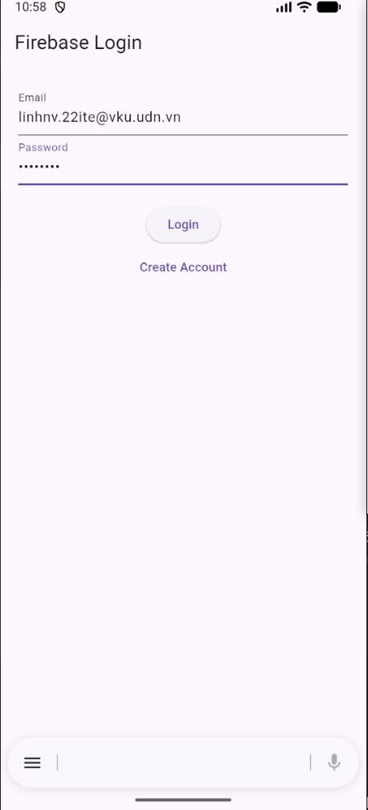
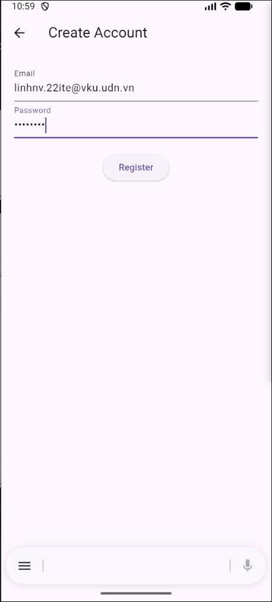

# Project 10: Firebase Login App

**Goal:** Integrate Firebase Authentication.

**Description:** Login/register with email & password and show user info.

**Technical Requirements:**

- `firebase_core`, `firebase_auth`
- `StreamBuilder` for auth state

**Outcome:** Firebase-based login app.

---

## Terminal / Setup Instructions

### 1️⃣ Tạo Firebase Project & bật Email/Password Authentication
1. Truy cập [Firebase Console](https://console.firebase.google.com/).
2. Click **Add project** → đặt tên project (ví dụ: `fir-login-app-flutter`) → tạo project.
3. Vào **Authentication** → **Sign-in method** → bật **Email/Password**.

### 2️⃣ Cài FlutterFire CLI
```bash
dart pub global activate flutterfire_cli
```
Nếu terminal báo "flutterfire: command not found", thêm vào PATH:
```bash
export PATH="$PATH:$HOME/.pub-cache/bin"
```
### 3️⃣ Cấu hình project Flutter với Firebase
```bash
cd <path-to-your-flutter-project>
flutterfire configure --project=<your-firebase-project-id>
```
CLI sẽ tạo file lib/firebase_options.dart.
### 4️⃣ Cài các dependency
```bash
flutter pub get
```
### 5️⃣ Chạy app Flutter
```bash
flutter run
```

## Screenshots

| Login | Register |
| ----- | -------- |
|  |  |

| Home |
| ----- |
|  |

---

